.. figure::  images/esa.jpg
   :align:   right
   :scale:   50%

.. _DPMD:

Detailed Processing Model Documentation (DPMD)
**********************************************

Introduction
============
This is the Detailed Processing Model Documentation (DPMD) for the Sen2Three application.

Purpose and Scope
-----------------
This document is produced in the context of the development of the Sentinel 2 level  3 processor.
Its purpose is to detail the algorithms of the software and to list and describe the individual modules classes and
functions of the software.

Applicable Documents
--------------------

Table 2-1: Applicable Documents

+------------------+------+-------------------------------------------+----------+
| Reference        | Code | Title                                     | Issue    |
+==================+======+===========================================+==========+
| L3_DPMD          | ATBD | Level 3 ATBD                              | 1.0      |
+------------------+------+-------------------------------------------+----------+

Reference Documents
-------------------

Table 2-2: Reference Documents

+------------------+------+-------------------------------------------+----------+
| Reference        | Code | Title                                     | Issue    |
+==================+======+===========================================+==========+
| L3_SUM           | SUM  | Software Installation and User Manual     | 1.0      |
+------------------+------+-------------------------------------------+----------+
| L3_PFS           | PFS  | Product Format Specification              | 1.0      |
+------------------+------+-------------------------------------------+----------+
| L3_IODD          | IODD | Input Output Data Definition              | 1.0      |
+------------------+------+-------------------------------------------+----------+

Acronyms and Abbreviations
--------------------------
All acronyms and abbreviations are listed in [L3-GLODEF]

Document Structure
------------------

This is the second part of a set of four documents describing the Sentinel 2 level  3 Processor for Spatio- Temporal
synthesis, consisting of:

1. Software Installation and User’s Manual (SUM);
2. Detailed Processing Model Documentation (DPMD), this document;
3. Product Format Specification (PFS);
4. Input Output Data Definition (IODD).

Chapter 2.2, the **High Level Processing Algorithm** gives an overview on the processors logic in form of pseudocode
and the corresponding function calls.

Chapter 2.3, the **Module Description** gives an overwiev on all Modules together with a short description on the functionality.

Chapter 2.4, the **Detailed Module Listing** will list for each Processor Module the dependency to the
other modules, followed by a listing of all classes, their relevant member functions and their corresponding
in and output parameters.

High Level Processing Algorithm
===============================

The high level processing algorithm acts as as follows:

* Input is a directory of users choice. This can contain a series of users products which all should belong to the same area of interest, but with different time stamps.
* The algorithm will perform a chronological sort and processes L2A products in a sequential way.
* All unprocessed L2A scenes will be processed. If no more unprocessed scenes are found, the algorithm will generate a L3 output product.
* The processor keeps a registry of already processed input data. The user can place new collected input data into the directory and restart the processing. The L3 product will be updated, containing the already processed scenes and the new collected ones.
* On users choice, the history of the processing can be deleted. The processor then will then generate a new L3 product and performs a new synthesis of all products contained in the input directory.

Step 1 - process L2A tiles::
    
    for each unprocessed L2A product in source directory:
        if product is within given time range:
            import L2A product metadata;
            if current L3 product not present:
                create L3 product;        
            for each tile in L2A product:
                import L2A tile metadata;
                import L2A bands;
                if current L3 tile not present:
                    create L3 tile;
                else:
                    perform L3 synthesis;
                    update L3 tile metadata;
                    update L3 bands;

Step 2 - post processing::

    update L3 product metadata;
    for each tile in L3 product:
        update L3 tile metadata;
        export L3 bands;
    
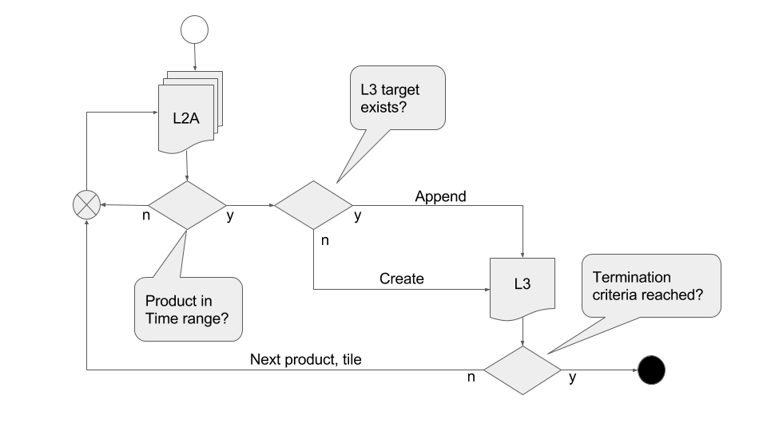

   Flow Diagram of Product Creation

Functional Groups
-----------------

Functional Group 1: Product Initialization
------------------------------------------
From main::

    create single object of class type L3_Config and initialize;
    L3_Config.updateUserProduct:
    if L3_Product.existL3_TargetProduct() == True:
        for tile in tile list:
            if L3_Tables.testBand == true:
                tile already present:
                L3_Product.reinitL3_TargetProduct;
                L3_Product.appendTile;
            else:
                new tile found:
                L3_Product.createL3_Tile;
    else:    
        create L3 target product and initialize:
            L3_Product.createL3_TargetProduct;

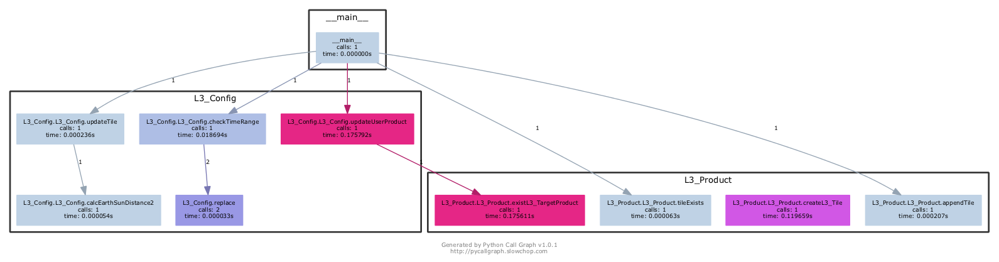
   
   Functional Group 1: Product Initialization

Functional Group 2: Table Initialization
----------------------------------------
From main::

    create single object of class type L3_Tables;
    L3_Tables.init:
        if Database exist:
            L3_Tables.importBandList('L2A'):
                convert JPEG 2000 images to database;
        else:
            L3_Tables.initDatabase;
            L3_Tables.importBandList('L3');
                convert JPEG 2000 images to database;
        L3_Tables.createPreviewImage('L3');

    L3_Tables.testBand:
        L3_Tables.verifyProductId;
        L3_Tables.getBandNameFromIndex;

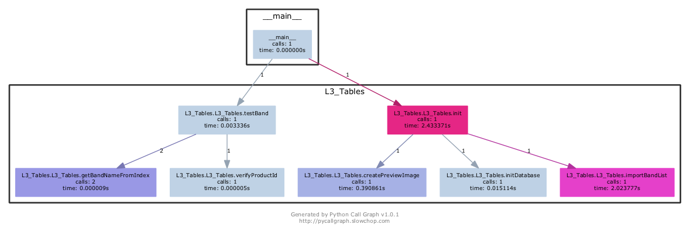

   Functional Group 2: Table Initialization

Functional Group 3: Pixel Mask Generation
-----------------------------------------
From main::

    create single object of class type L3_Synthesis;
    L3_Sythesis.preProcessing:
        L3_Synthesis.setPixelMasks:
            1. initialize good and bad pixels;
            2. create mosaic map, if not exist, else read from L3_Tables;
            3. replace always bad pixels of previous classification map, if 'better' pixels exist;
            4. update mosaic map and scene classification map according to selected algorithm:
                if self.config.algorithm == 'MOST_RECENT':
                    previous classification map will always be replaced with good pixels of recent classification map;
                else if self.config.algorithm == 'TEMP_HOMOGENEITY':
                    previous classification map will only be replaced if sum of current good pixels
                    is better than sum of good pixels of the best classification map in the past;
                else if self.config.algorithm == 'RADIOMETRIC_QUALITY':
                    previous classification map will be replaced if either:
                    - the average of the current AOT or
                    - the average of the current Solar Zenith Angle
                    is better than the equivalent parameter of the best classification map in the past;
                else if self.config.algorithm == 'AVERAGE':
                    images are an average of the current good pixels and the
                    good pixels of all previous scenes. Mosaic map is the per pixel sum
                    of all good pixels in the past and is used for calculating the average;
            5. update good and bad pixel masks;
        Subroutines:
            L3_Tables.testBand;
            L3_Tables.getBand;
            L3_Tables.setBand;

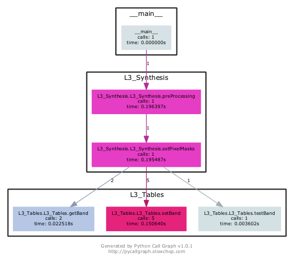

   Functional Group 3: Pixel Mask Generation

Functional Group 4: Synthesis Algorithms
----------------------------------------
From main::

    L3_Sythesis.forwardProcessing:
        the default processing routine, removes clouds and dark features.
        for all bands in tile:
            L3_Sythesis.replaceBadPixels:
            1. get the bands from previous and current scene;
            2. get the good pixel masks from function L3_Synthesis.setPixelMasks;
            3. replace always bad pixels of previous scene, if 'better' pixels exist in recent scene;
            4. update bands according to selected algorithm:
               if self.config.algorithm == 'MOST_RECENT':
                    previous pixels will always be replaced with good pixels of recent scene;
               else if self.config.algorithm == 'TEMP_HOMOGENEITY':
                    previous pixels will only be replaced if sum of current good pixels
                    is better than sum of good pixels of the best scene in the past;
               else if self.config.algorithm == 'RADIOMETRIC_QUALITY':
                    previous pixels will be replaced if either:
                    - the average of the current AOT or
                    - the average of the current Solar Zenith Angle
                    is better than the equivalent parameter of the best scene in the past;
               else if self.config.algorithm == 'AVERAGE':
                    images are an average of the current good pixels and the
                    good pixels of all previous scenes. Mosaic map is the per pixel sum
                    of all good pixels in the past and is used for calculating the average;
        L3_Synthesis.updateTileStatistics:
            1. update metadata for mosaic map;
            2. update metadata for scene classification map;
            3. update metadata on tile base;
    Subroutines:
        L3_Tables.getBand;
        L3_Tables.setBand;

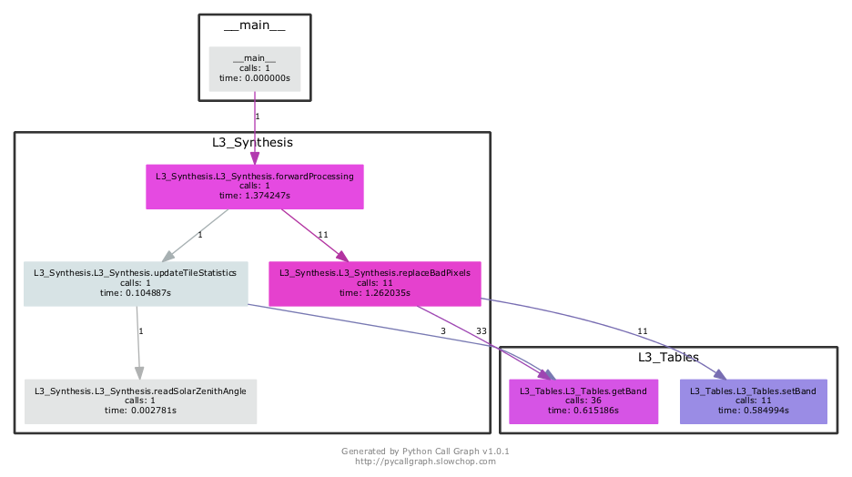

   Functional Group 4: Synthesis Algorithms

Functional Group 5: Level 3 Product Export
------------------------------------------
From main::

    L3_Process.postProcess:
        L3_Sythesis.postProcess:
            L3_Synthesis.updateProductStatistics:
                validate the metadata;
        L3_Tables.exportTile:
            L3_Tables.exportBandList:
                convert database to JPEG 2000 images;
        L3_Product.postProcess:
            copy and terminate the logging;

.. figure::  images/postprocessing.png
   :align:   center

   Functional Group 5: Level 3 Product Export

Module Description
==================

The Sen2Three application is designed by the following essential modules (classes):

*  **L3_Process:** main processor module, coordinates the interaction between all other modules.

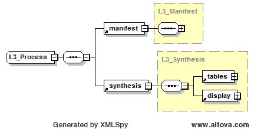

   L3_Process

*  **L3_Config:** this class keeps the configuration parameters for an easy access for all other modules.

   L3_Config

*  **L3_Product:** this class provides the generation and access to the xml based metadata forming the level 2a and level 3 products. It has a reference to an L3_Config object.

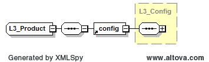

   L3_Product

*  **L3_Tables:** this class manages the conversion of the JPEG-2000 based input data to an internal format (and vice versa). It provides a high performance access to the image data for all other modules. It has a reference to an L3_Product object.

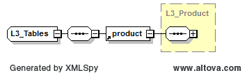

   L3_Tables

*  **L3_Synthesis:** this class performs the four level 3 synthesis algorithms: **Most Recent**, **Temporal Homogeneity**, **Radiometric Quality** and **Average** wich are detailed in the :ref:`algorithms` section of the [SUM]. It has a reference to an L3_Tables module.

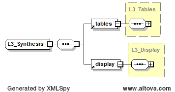

   L3_Synthesis

*  **L3_Display:** this is an an optional class for the data display and plot. It can be activated via a configurable option.

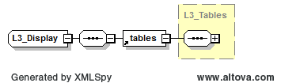

   L3_Display

*  **L3_XmlParser:** this is a helper class, wrapping the access to the tree based xml metadata into the form of high level input output routines. It also provides a validator for the consistency check of the product metadata, using xsd schemes.

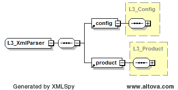

   L3_Xml_Parser

Detailled Module Listing
========================

It follows a detailed listing of all Modules, Classes and Functions

L3_Process
----------

.. automodule:: sen2three.L3_Process
    :members:

L3_Config
---------

.. automodule:: sen2three.L3_Config
    :members:

L3_Product
----------

.. automodule:: sen2three.L3_Product
    :members:

L3_Tables
---------

.. automodule:: sen2three.L3_Tables
   :members:

L3_Synthesis
------------

.. automodule:: sen2three.L3_Synthesis
    :members:

L3_Display
----------

.. automodule:: sen2three.L3_Display
    :members:

L3_XmlParser
------------

.. automodule:: sen2three.L3_XmlParser
    :members:

L3_Library
----------

.. automodule:: sen2three.L3_Library
    :members:

Module contents
---------------

.. automodule:: sen2three
    :members:
