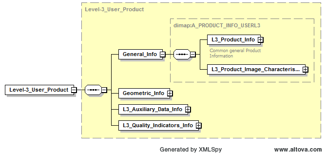
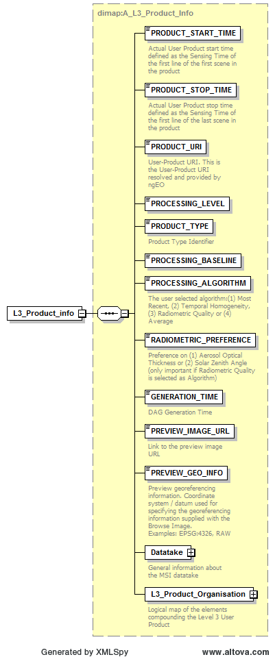
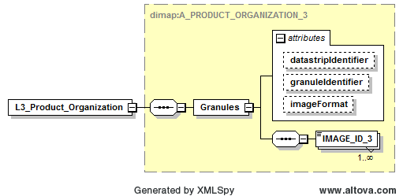
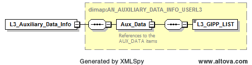
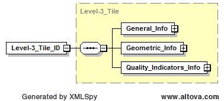
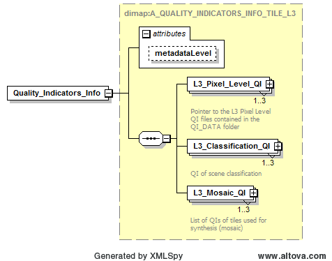
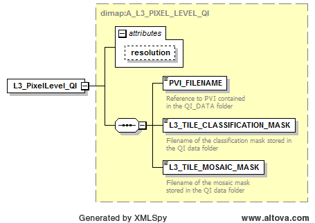
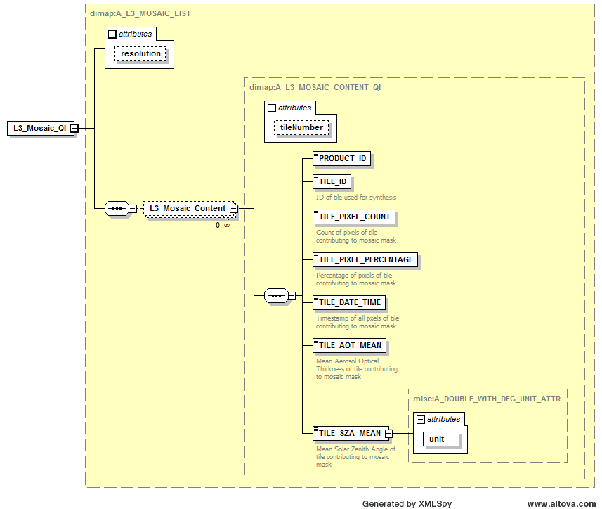

.. figure::  images/esa.jpg
   :align:   right
   :scale:   50%

.. _PFS:

Product Format Specification (PFS)
**********************************

Introduction
============
This is the Product Format Specification (PFS) for the Sen2Three application.

Purpose and Scope
-----------------
This document is produced in the context of the development of the Sentinel 2 metadata level 3 processor.
Its purpose is to detail the product format specification for the metadata level 3 metadata.

Applicable Documents
--------------------

Table 3-1: Applicable Documents

+------------------+------+-------------------------------------------+----------+
| Reference        | Code | Title                                     | Issue    |
+==================+======+===========================================+==========+
| L3_DPMD          | ATBD | Level 3 ATBD                              | 1.0      |
+------------------+------+-------------------------------------------+----------+
| L2A_PDD          | PFS  | Sentinel-2 MSI Product Definition Doc.    | 14.2     |
+------------------+------+-------------------------------------------+----------+
| L1C_PSD          | PSD  | Sentinel-2 MSI Product Format Specif.     | 14.2     |
+------------------+------+-------------------------------------------+----------+

Reference Documents
-------------------

Table 3-2: Reference Documents

+------------------+------+-------------------------------------------+----------+
| Reference        | Code | Title                                     | Issue    |
+==================+======+===========================================+==========+
| L3_SUM           | SUM  | Software Installation and User Manual     | 1.0      |
+------------------+------+-------------------------------------------+----------+
| L3_DPMD          | DPMD | Detailed Processing Model Documentation   | 1.0      |
+------------------+------+-------------------------------------------+----------+
| L3_IODD          | IODD | Input Output Data Definition              | 1.0      |
+------------------+------+-------------------------------------------+----------+

Acronyms and Abbreviations
--------------------------
All acronyms and abbreviations are listed in [L3-GLODEF]

Document Structure
------------------

This is the third part of a set of four documents describing the Sentinel 2 metadata level 3 Processor for Spatio-Temporal
synthesis, consisting of:

1. Software Installation and User’s Manual (SUM);
2. Detailed Processing Model Documentation (DPMD);
3. Product Format Specification (PFS), this document;
4. Input Output Data Definition (IODD).

The metadata level 3 PFS is an extension of the existing metadata level 2a product format. This document will only show the added or
changed metadata with respect to metadata level 2a. All other specifications can be obtained from the
corresponding specifications for the metadata level 1c and metadata level 2a user product as given in the list of applicable documents
above. The following section details the products according to their positions in the metadata.

Product Details
===============

Level 3 User Product
--------------------

Changes in the product format specification on User Product level concern the following three subtrees::

    General_Info/L3_Product_Info
    L3_Auxiliary_Data_Info
    L3_Quality_Indicators_Info

   Level 3 User Product

Level 3 Product Info
--------------------

On the metadata level 3 Product Info metadata level the following entries are added / replaced:

Table 3-3: Added / replaced entries on Product Info metadata level

+------------------------+---------+----------+-----------+--------------------------------------+
| Key                    | Default | Type     | Range     | Description                          |
+========================+=========+====+=====+===========+======================================+
| PRODUCT_START_TIME     | n/a     | time_str | n/a       | Lower border acquisition time        |
+------------------------+---------+----------+-----------+--------------------------------------+
| PRODUCT_END_TIME       | n/a     | time_str | n/a       | Upper border acquisition time        |
+------------------------+---------+----------+-----------+--------------------------------------+
| PROCESSING_LEVEL       | Level-3p| string   | n/a       | according to existing PFS V13        |
+------------------------+---------+----------+-----------+--------------------------------------+
| PRODUCT_TYPE           | S2MSI3p | string   | n/a       | according to existing PFS V13        |
+------------------------+---------+----------+-----------+--------------------------------------+
| PROCESSING_ALGORITHM   | n/a     | enum     | 1 - 4     | according to L3_GIPP                 |
+------------------------+---------+----------+-----------+--------------------------------------+
| RADIOMETRIC_PREFERENCE | n/a     | enum     | 1 - 2     | according to L3_GIPP                 |
+------------------------+---------+----------+-----------+--------------------------------------+
| GENERATION_TIME        | n/a     | time_str | n/a       | generation time of L3 target         |
+------------------------+---------+----------+-----------+--------------------------------------+

All other parameter are equivalent to the L2A parent products.

   Level 3 Product Info

Level 3 Product Organisation
----------------------------

In the level 3 Product Organisation metadata level the list of level 2a input tiles is replaced by the corresponding level 3
output tiles::

    <L3_Product_Organisation>
        <Granule_List>
          <Granules granuleIdentifier="S2A_USER_MSI_L03_TL_MTI__20150812T154929_A000534_T32UMA_N01.03"
            datastripIdentifier="S2A_USER_MSI_L03_DS_MTI__20150812T154929_S20150730T103016_N01.03"
            imageFormat="JPEG2000">
            <IMAGE_ID_3>S2A_USER_MSI_L03_TL_MTI__20150812T154929_A000534_T32UMA_B02_20m</IMAGE_ID_3>
            <IMAGE_ID_3>S2A_USER_MSI_L03_TL_MTI__20150812T154929_A000534_T32UMA_B03_20m</IMAGE_ID_3>
            ...

   Level 3 Product Organisation

Level 3 Auxiliary Data Info
---------------------------

In the level 3 Auxiliary Data Info metadata level the name of the L3_GIPP has been added::

    <n1:L3_Auxiliary_Data_Info>
        <Aux_Data>
            <L3_GIPP_LIST>
                <GIPP_FILENAME
                    type="GIP_Level-3p"
                    version="1.1.0">S2A_USER_GIP_L03_TL_MTI__20150812T154929_A000534_T32UMA
                </GIPP_FILENAME>

   Level 3 Auxiliary Data Info

Level 3 Tile ID
---------------

On tile level, in the General Info metadata level TILE_ID and DATASTRIP_ID are replaced by the corresponding level 3 entries::

    <n1:General_Info>
        <TILE_ID_3>S2A_USER_MSI_L03_TL_MTI__20150812T154929_A000534_T32UMA_N01.03</TILE_ID_3>
        <DATASTRIP_ID_3>S2A_USER_MSI_L03_DS_MTI__20150812T154929_S20150730T103016_N01.03</DATASTRIP_ID_3>

   Level 3 Tile ID

Level 3 Quality Indicators Info
-------------------------------
The level 3 Quality Indicators Info metadata level has been substantially extended compared to the level 2a metadata. It consists
of three substructures named as:

1. L3_Pixel_Level_QI
2. L3_Classification_QI
3. L3_Mosaic_QI

   Level 3 Quality Indicators Info

Level 3 Quality Indicators Info on pixel level
----------------------------------------------

The Level 3 Quality Indicators Info on pixel level contain a list of between one and three sub entries referred by the
resolution attribute, which can take the values of 10, 20 and 60. Each of the three possible sub entries contains a set
of references to:

1. The level 3 preview file, located in the QI_DATA folder on GRANULE level.
2. The level 3 scene classification map, located in the QI_DATA folder on GRANULE level.
3. The level 3 mosaic map, located in the QI_DATA folder on GRANULE level.

   Level 3 Quality Indicators Info on pixel level

Level 3 Classification Quality Indicators
-----------------------------------------

The metadata level 3 Classification Quality Indicators Info on pixel level contain a list of between one and three sub entries
separated by the resolution attribute, which can take the values of 10, 20 and 60. Each of the three possible sub entries
contains a table of statistical values for the current level 3 output product, which are:

Table 3-4: Level 3 statistics on classification level (absolute)

+----------------------------------------------------------------+
| L3_Classification_QI, absolute                                 |
+----------------------------------------------------------------+
| - Type: unsigned int                                           |
| - Range: 0 : 120560400                                         |
| - Description: count of all occurrences of classified pixel.   |
+----------------------------------------------------------------+
| Key                                                            |
+================================================================+
| TOTAL_PIXEL_COUNT                                              |
+----------------------------------------------------------------+
| NODATA_PIXEL_COUNT                                             |
+----------------------------------------------------------------+
| SATURATED_DEFECTIVE_PIXEL_COUNT                                |
+----------------------------------------------------------------+
| DARK_FEATURES_COUNT                                            |
+----------------------------------------------------------------+
| CLOUD_SHADOW_COUNT                                             |
+----------------------------------------------------------------+
| VEGETATION_COUNT                                               |
+----------------------------------------------------------------+
| NOT_VEGETATED_COUNT                                            |
+----------------------------------------------------------------+
| WATER_COUNT                                                    |
+----------------------------------------------------------------+
| UNCLASSIFIED_COUNT                                             |
+----------------------------------------------------------------+
| MEDIUM_PROBA_CLOUDS_COUNT                                      |
+----------------------------------------------------------------+
| HIGH_PROBA_CLOUDS_COUNT                                        |
+----------------------------------------------------------------+
| THIN_CIRRUS_COUNT                                              |
+----------------------------------------------------------------+
| SNOW_ICE_COUNT                                                 |
+----------------------------------------------------------------+

Table 3-5: Level 3 statistics on classification level (percentage)

+----------------------------------------------------------------+
| L3_Classification_QI, percentage                               |
+----------------------------------------------------------------+
| - Type: float32                                                |
| - Range: 0.0 : 100.0                                           |
| - Description:                                                 |
| - NO_DATA - percentage relative to all pixels of image.        |
| - all other - percentage relative to all data pixels of image. |
+----------------------------------------------------------------+
| Key                                                            |
+================================================================+
| NODATA_PIXEL_PERCENTAGE                                        |
+----------------------------------------------------------------+
| SATURATED_DEFECTIVE_PIXEL_PERCENTAGE                           |
+----------------------------------------------------------------+
| DARK_FEATURES_PERCENTAGE                                       |
+----------------------------------------------------------------+
| CLOUD_SHADOW_PERCENTAGE                                        |
+----------------------------------------------------------------+
| VEGETATION_PERCENTAGE                                          |
+----------------------------------------------------------------+
| NOT_VEGETATED_PERCENTAGE                                       |
+----------------------------------------------------------------+
| WATER_PERCENTAGE                                               |
+----------------------------------------------------------------+
| UNCLASSIFIED_PERCENTAGE                                        |
+----------------------------------------------------------------+
| MEDIUM_PROBA_CLOUDS_PERCENTAGE                                 |
+----------------------------------------------------------------+
| HIGH_PROBA_CLOUDS_PERCENTAGE                                   |
+----------------------------------------------------------------+
| THIN_CIRRUS_PERCENTAGE                                         |
+----------------------------------------------------------------+
| SNOW_ICE_PERCENTAGE                                            |
+----------------------------------------------------------------+

.. figure::  images/L3_Classification_QI.png
   :align:   center

   Level 3 Quality Indicators Info

Level 3 Quality Indicators Info on Tile Mosaic Level
----------------------------------------------------

The level 3 Quality Indicators Info on tile mosaic level contain a list of statistical information for each processed
tile, separated by the resolution attribute, which can take the values of 10, 20 and 60. Each of the three possible sub
entries contain a list referred by the tile number, which is the sequential number of processed tiles in temporal order.

Table 3-6: level 3 statistics on pixel level (mosaic map)

+-----------------------+---------+---------+-----------+---------------------------------+
| Key                   | Default | Type    | Range     | Description                     |
+=======================+=========+=========+===========+=================================+
| TILE_NUMBER           | n/a     | ubyte   | 1 : 255   | Number of tile in sequence.     |
+-----------------------+---------+---------+-----------+---------------------------------+
| PRODUCT_ID            | n/a     | string  | n/a       | The product ID                  |
+-----------------------+---------+---------+-----------+---------------------------------+
| TILE_ID               | n/a     | string  | n/a       | Tile ID referenced              |
|                       |         |         |           | by tile number (see above).     |
+-----------------------+---------+---------+-----------+---------------------------------+
| TILE_PIXEL_COUNT      | n/a     | ubyte   | 1 : 255   | Count of all pixels matching    |
|                       |         |         |           | the given tile ID.              |
+-----------------------+---------+---------+-----------+---------------------------------+
| TILE_PIXEL_PERCENTAGE | n/a     | float32 | 0 : 100.0 | Percentage of all pixels        |
|                       |         |         |           | matching the given tile ID.     |
+-----------------------+---------+---------+-----------+---------------------------------+
| TILE_DATE_TIME        | n/a     | time    | n/a       | Acquisition time stamp of       |
|                       |         | string  |           | tile referenced by tile nr.     |
+-----------------------+---------+---------+-----------+---------------------------------+
| TILE_AOT_MEAN         | n/a     | float32 | 0 : 100.0 | Mean AOT of tile                |
|                       |         |         |           | referenced by tile number.      |
+-----------------------+---------+---------+-----------+---------------------------------+
| TILE_SZA_MEAN         | n/a     | float32 | 0 : 70.0  | mean SZA of tile                |
|                       |         |         |           | referenced by tile number.      |
+-----------------------+---------+---------+-----------+---------------------------------+

   Level 3 Quality Indicators Info on tile mosaic level

APPENDIX
========

A full specification of all DIMAP parameter can be obtained from L3_DIMAP_.

.. _L3_DIMAP: http://step.esa.int/thirdparties/sen2three/1.1.0/sen2three-1.1.0_doc/_dimap/dimap3.html