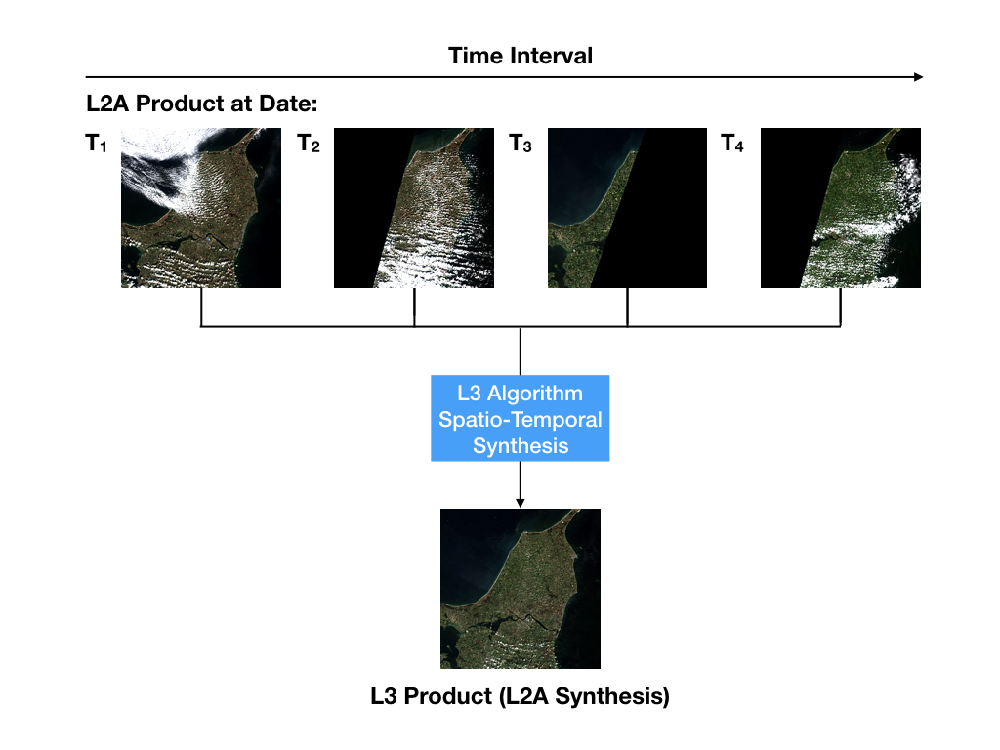
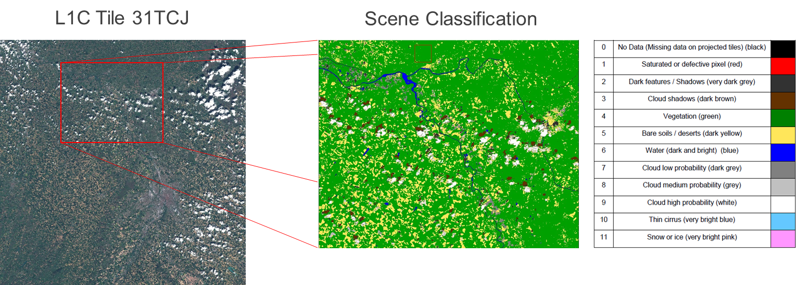
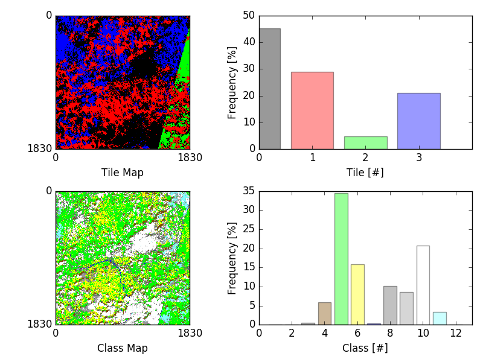
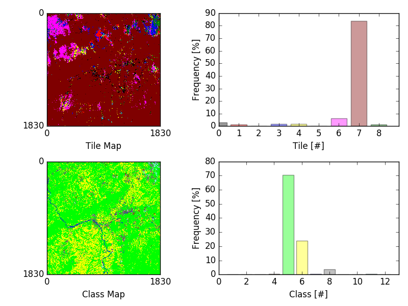
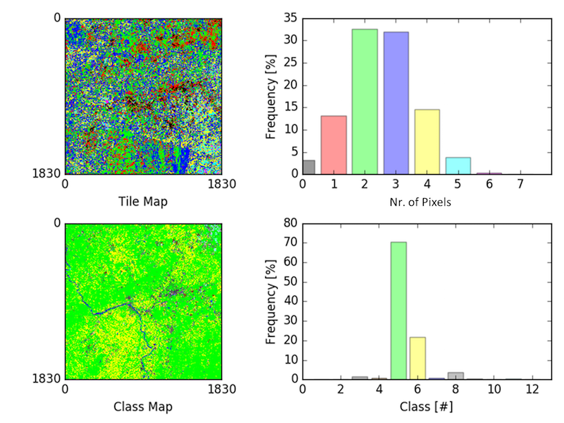
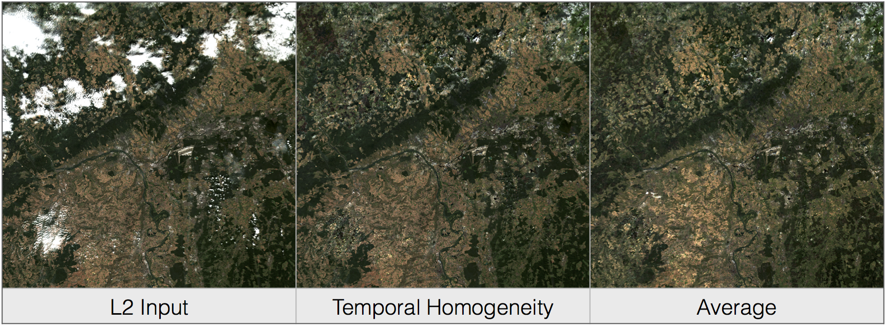

.. figure::  images/esa.jpg
   :align:   right
   :scale:   50%

.. _SUM:

Software Installation and User's Manual (SUM)
*********************************************

Introduction
============
This document is the Software Installation and User Manual (SUM) for the Sentinel-2 level 3 Processor
for spatio temporal synthesis, labelled as Sen2Three.

Changes of release 1.2: **Compatibility with PSD version 14.5**

*   Sen2Three supports the "safe compact" format which was introduced with PSD version 14.2. Sen2Three will detect the version
    automatically when reading a product. No configuration changes are necessary. The Level 3 output will
    always be generated in the PSD version 14.5 compatible safe compact format.

*   If Sen2Three is detecting a version 14.2 formatted Level 2a input product, it will
    convert it first into a version 14.5 compatible safe compact Level 3 product and processes it afterwards.
    This allows a mixed input of Version 14.5 and 14.2 Level 2a products in the same directory at the same time.

*   Sen2Three is compatible to Sen2Cor 2.8.0, PSD Formats below 14.2 are no longer supported.

Purpose and Scope
-----------------
This document is produced in the context of the development of the Sentinel 2 level 3 processor.
Its purpose is to detail the Operation, Installation and Configuration of the Processor Software.

Applicable Documents
--------------------

Table 1-1: Applicable Documents

+------------------+------+-------------------------------------------+----------+
| Reference        | Code | Title                                     | Issue    |
+==================+======+===========================================+==========+
| L3_ATBD          | ATBD | Level 3 ATBD                              | 1.0      |
+------------------+------+-------------------------------------------+----------+

Reference Documents
-------------------

Table 1-2: Reference Documents

+------------------+------+-------------------------------------------+----------+
| Reference        | Code | Title                                     | Issue    |
+==================+======+===========================================+==========+
| L3_DPMD          | DPMD | Detailed Processing Model Documentation   | 1.0      |
+------------------+------+-------------------------------------------+----------+
| L3_PFS           | PFS  | Product Format Specification              | 1.2      |
+------------------+------+-------------------------------------------+----------+
| L3_IODD          | IODD | Input Output Data Definition              | 1.2      |
+------------------+------+-------------------------------------------+----------+

Acronyms and Abbreviations
--------------------------
All acronyms and abbreviations are listed in [L3-GLODEF]

Document Structure
------------------

This is the first part of a set of four documents describing the Sentinel 2 level 3 Processor for Spatio- Temporal
synthesis, consisting of:

1. Software Installation and User’s Manual (SUM), this document;
2. Detailed Processing Model Documentation (DPMD);
3. Product Format Specification (PFS);
4. Input Output Data Definition (IODD).

Chapter 1.2, the **Operational Concept** describes the general usage of the processor, its algorithms and shows
characteristic examples for the processing of the different algorithms.

Chapter 1.3, **Installation and Setup** describes in detail how the processor itself and its runtime environment
will be installed and set up for operation.

Chapter 1.4, **Configuration** details the individual configuration parameters of the processor's ground image
processing parameters (GIPP).

Chapter 1.5, **Operation** describes how the processor will be operated from command line and as plugin inside of
the SNAP toolbox.

Chapter 1.6, the **Appendix** will list among others the complete GIPP for reference.

Operational Concept
===================

.. _Sen2Cor: http://step.esa.int/main/third-party-plugins-2/sen2cor

Sen2Three is a level 3 processor for the Spatio-Temporal Synthesis of bottom of atmosphere corrected level 2a images,
as they are generated by the Sen2Cor_ application. Sen2Three takes time series of level 2a images of certain geographical
areas as input and generates a synthetic output image by replacing step by step all invalid pixels of previous
input images with the collocated valid pixels of scenes following in time.

Valid Pixels are hereby defined as primarily clear sky images with output pixels identified as vegetation (green),
soils (yellow), or water (blue). Invalid Pixels are defined as medium and high probability clouds (medium grey and white),
dark features or terrain shadows (dark grey), cloud shadows (brown) and optionally, thin cirrus (light blue) or snow
(pink).

Scene Classification and the Radiometric Quality are obtained from the Sen2Cor level 2a algorithms for Atmospheric
Correction, which is a necessary tool for obtaining the appropriate level 2a input products.

The level 3 spatio temporal synthesis algorithm generates a synthetic output image of a certain geographical area,
divided into a series of “tiles”, using time series of collocated input images of the area and replacing step
by step all contaminated (bad) pixels of the output with equivalent valid pixels. Input images are a collection of
level 2a products acquired sequentially during a certain time period and prepared by Sen2Cor for subsequend processing.
Figure 1.1 shows an overview on the general sequential processing chain.

    Sequential Processing Chain

.. _L2A_SUM: http://step.esa.int/thirdparties/sen2cor/2.3.1/%5bL2A-SUM%5d%20S2-PDGS-MPC-L2A-SUM%20%5b2.3.0%5d.pdf

As the level 3 processing requires a full classification of the input scenes in order to perform its different synthesis
algorithms, the scene classification algorithm of the Sen2Cor processor as a pre-processing step is always required.
For level 2a input products this is performed during the level 2a processing via Sen2Cor. Non atmospheric corrected
level 1c images can also serve as inputs. This is provided via an option of the Sen2Cor processor, where only a
resampling of the L1c input products, followed by a scene classification is performed. See the Sen2Cor User Manual
(L2A_SUM_) for the special option ‘--sc_only”.

The Sen2Three algorithms work tile based. The spatio temporal synthesis will be performed separately for all
tiles matching the same geographic area. If tiles are missing in some of the user products forming a data strip,
these will be ignored.

During the pre-processing Sen2Three will generate a list of tiles to be processed. Only those tiles which
match a certain time window will be accounted for the processing. The time window is configurable and can
be specified in the Ground Image Processing Parameter (GIPP) File, which is located in the Sen2Three home
directory (see Configuration_).

Scene Classification
--------------------
The Sen2Cor Scene Classification algorithm allows to detect clouds, snow and cloud shadows and to generate a
classification map, which consists of 4 different classes for clouds (including cirrus), together with six different
classifications for shadows, cloud shadows, vegetation, soils / deserts, water and snow. The algorithm is based on a
series of threshold tests that use as input top-of-atmosphere reflectance from the Sentinel-2 spectral bands. In
addition, thresholds are applied on band ratios and indexes like the Normalized Difference Vegetation - and Snow Index
(NDVI, NDSI). For each of these thresholds tests, a level of confidence is associated. The algorithm uses the reflective
properties of scene features to establish the presence or absence of clouds in a scene. Cloud screening is applied to
the data in order to retrieve accurate atmospheric and surface parameters as used here for the level 3 processing.
Figure 1.2 below shows the derivation of a scene classification from a level 1c input tile. The bar on the right
shows the corresponding colour coding.

   Scene Classification

Table 1-3: Scene Classification Identifier

+---------------------+-------+
| Key                 | Value |
+=====================+=======+
| NODATA              | 0     |
+---------------------+-------+
| SATURATED_DEFECTIVE | 1     |
+---------------------+-------+
| DARK_FEATURES       | 2     |
+---------------------+-------+
| CLOUD_SHADOW        | 3     |
+---------------------+-------+
| VEGETATION          | 4     |
+---------------------+-------+
| NOT_VEGETATED       | 5     |
+---------------------+-------+
| WATER               | 6     |
+---------------------+-------+
| UNCLASSIFIED        | 7     |
+---------------------+-------+
| MEDIUM_PROBA_CLOUDS | 8     |
+---------------------+-------+
| HIGH_PROBA_CLOUDS   | 9     |
+---------------------+-------+
| THIN_CIRRUS         | 10    |
+---------------------+-------+
| SNOW_ICE            | 11    |
+---------------------+-------+

Level 3 Synthesis
-----------------

Valid pixels of a level 1c or level 2a input product are primarily clear sky areas in which the output pixels are
identified to be of one of the three alternative pixel types vegetation (4), soils (5), or water (6). Invalid pixels are
classified either as being clouds (7-9) or one of the pixel types 1-2. Cloud shadows (3), thin cirrus (10) and snow
(11) can be optionally configured as belonging to the invalid pixel group.

The scene classification map introduced above will be updated during each sequential step. In an ideal synthesized
scene only the five classes 4 - 6 and 11 (if permafrost occurs) would be present. However, as the Sen2Cor scene
classificator has no ability to classify urban areas in the first run, those areas are initially classified as clouds
of low or medium probability. As these areas are static, a small fraction of these two classes will remain, and thus
(potentially) can be reclassified to urban areas in the long run.

Tile Map
--------
A new level 3 map type will be generated and updated
during the synthesis: the Tile Map is an indexed mosaic allowing conclusions on
the history of the sequential synthesis. Each processed tile is indexed by a sequential number referring to the
corresponding tile ID within the sequence. For the first three algorithms described in the following, the tile map
thus gives an assignment between the output pixels and the tile they are origin. For the average algorithm, the meaning
is different: here the sequential number marks how many tiles have been used for calculating the averaged single pixel values.

.. _algorithms:

Algorithms
----------
Four different algorithms are implemented, which determine the method how the
final output product will be synthesized. For all images in all bands invalid
pixels will always be replaced by good ones (if apparent). The replacement of pixels characterized as
good will be performed according to following rules:

*  **Most Recent:** good pixels of the output scene will always be replaced by
   good pixels of the current scene, if the time stamp of the recent scene is more actual that the time stamp of all
   past scenes.

*  **Temporal Homogeneity:** good pixels of the output scene will be replaced by
   the equivalent good pixels of the current scene, if the sum of good pixels
   of the current scene is higher than the sum of good pixels of any scene in
   the past. This algorithm will always prioritize the "best" scenes in the course
   of time.

*  **Radiometric Quality:** good pixels of the output scene will be replaced by by
   good pixels of the current scene, if either: the average of the Aerosol Optical Thickness is less or
   the average of the Solar Zenith Angle is higher than the
   equivalent parameter of the best scene in the past. The criteria are configurable.
   Again, this algorithm will always prioritize the "best" scenes in the course
   of time.

*  **Average:** the output scene is an average of the good pixels of all
   processed scenes. The 'Mosaic Map' is the per pixel sum of all good pixels
   of the past scenes and is used for calculating the most recent average. In contrast
   to the former algorithms, the average will not prioritize a tile. Pixels of all
   tiles classified as valid will contribute to the final synthesized image.

If only cloudy pixels can be found for the previous scenes and the current sample, a prioritization based on lower
cloud probability is performed.

Figure 1.3 and 1.4 below show the output of the Temporal Homogeneity algorithm: a tile map of indices is generated and
updated during the synthesis: the colours of the tile map at top left represent those pixels obtained for the
corresponding sequence. Figure 1.3 shows the synthesis at an early step, after three tiles have been accumulated.
As none of the subsequent tiles 2 and 3 have a higher sum of valid pixels compared to tile 1, no update of the overall
map is performed yet, and only invalid pixels are replaced. The gray bar in the upper histogram shows the frequency of
pixels which have not been replaced at this stage, corresponding to the clouds as shown in the class map in the lower
row.

   Temporal Homogeneity Algorithm after 3 processing cycles.

The temporal homogeneity criterion influences the selection of valid pixels in order to get a final L3 synthesis rather
composed with large patches of pixels acquired at the same date. This can be seen in a later stage of the same synthesis
process: tile number 7 has the highest number of valid pixels and thus replaces all occurences of collocated valid
pixels from the past. The sucessor, tile 8 in contrast has only a very limited contribution to the tile map.

   Temporal Homogeneity Algorithm after 8 processing cycles.

In Figure 1.5 the average algorithm is used instead. Averaging can be useful in situations, when only a collection of
very noisy input images are available in order to homogenize the output product. In this example, each pixel of the
output product is an average between 1 and 6 valid pixels of all available input sequences. In contrast to the temporal
homogeneity algorithm where the number (color) represents the according tile ID, the number in the tile map of Figure 1.5
represents the sum of tiles used for the averaging of the corresponding pixel. It is obvious that this kind of averaging
will even out periodic changes in reflectance values, whereas the other algorithms might lead to strong contrasts
between areas of different datatakes. It is in the responibility of the user to decide which algorithm is more
appropriate for his specific needs.

   Average Algorithm

Figure 1.6 shows a comparison between the outputs of the Temporal Homogeneity output vs. the Average algorithm.
It can be seen that for the average output especially the soil pixels are somewhat brighter compared to the temporal
homogeneity output, as it is the mean of several input images. The left tile shows the corresponding L2a best input tile.

   Left: L2a Input, best scene, mid: Temporal Homogeneity, right: Average algorithm. Outputs after 8 iterations.

Figure 1.7 depicts a processing sequence of 8 consecutive tiles ordered by time. On the left the RGB composites of Bands
2-4 of the original level 2a input tiles, on the right, the synthesized tiles following the temporal
homogeneity algorithm are shown.

.. figure::  images/ProcessingSequence.png
   :align:   center
   :scale:   25 %

   Processing Sequence

Outputs
-------
After the processing has been performed, a new level 3 user product will be generated and can be found in the Level 3
output directory as configured in the L3 GIPP configuration file (see below).

* New QI metadata for the level 3 synthesis, giving the statistics for the synthesized output product.
* The synthesized tile images for all bands for the given resolution.
* The updated scene classification excluding "invalid pixels" for all tiles.
* The L3 tile map for all tiles, showing the contingent of each individual input product to the final synthesized images as it is detailed in the statistics of the metadata.

All new metadata are described in detail in the :doc:`pfs`.
The details on the generated products can be found in the :doc:`iodd`.

.. _inst:

Installation and Setup
======================

Sen2Three is completely written in Python 2.7. It will support the three following Operating Systems:

* Linux,
* Mac OSX,
* Windows,

(64 bit is mandatory).

The installation of the whole system is performed in two steps:

* Installation or upgrade of the Anaconda Runtime Environment
* Installation of the Processor itself.

.. _Anaconda2: https://www.continuum.io/why-anaconda

The Sen2Three application works under the umbrella of the Anaconda (Python 2.7) distribution package. It is built using
the Anaconda2 V.4.0 Development and Runtime Environment. A detailled description can be found here: (Anaconda2_).

Anaconda Upgrade
----------------
If you have already installed Anaconda on you platform, due to an installation of Sen2Cor, no further action is
necessary. If your Anaconda version should be updated, you can perform the following command via the command line::

    C:\>conda update conda
    Using Anaconda Cloud api site https://api.anaconda.org
    Fetching package metadata: ....

Should end with displaying the following information::

    conda                     4.0.5                    py27_0

    C:\>conda update anaconda
    Using Anaconda Cloud api site https://api.anaconda.org
    Fetching package metadata: ....

Should end with displaying the following information::

    anaconda                  4.0.0               np110py27_0

Then, check the proper installation with::

    C:\>python
    Python 2.7.11 |Anaconda 4.0.0 (64-bit)| (default, Feb 16 2016, 09:58:36) [MSC v.1500 64 bit (AMD64)] on win32
    Type "help", "copyright", "credits" or "license" for more information.
    Anaconda is brought to you by Continuum Analytics.
    Please check out: http://continuum.io/thanks and https://anaconda.org

You then can skip the next section and continue with the setup of Sen2Three.

Anaconda Installation from Scratch
----------------------------------
If you never installed Anaconda before, then follow the steps below:

Download the recent version of the Anaconda python distribution for your operating system from:
http://continuum.io/downloads and install it according to the default recommendations of the anaconda installer.
It is strongly recommended to choose a local installation, except if you have the full administrator
rights on your machine.

At the end of the installation, open a command line window and check the proper installation by typing “python.”
It should display::

    C:\>python
    Python 2.7.11 |Anaconda 4.0.0 (64-bit)| (default, Feb 16 2016, 09:58:36) [MSC v.1500 64 bit (AMD64)] on win32
    Type "help", "copyright", "credits" or "license" for more information.
    Anaconda is brought to you by Continuum Analytics.
    Please check out: http://continuum.io/thanks and https://anaconda.org

Deinstallation of an old Sen2Three installation
-----------------------------------------------
A deinstallation of an existing sen2three installation can be performed with::

    C:\Users\<local_user>>pip uninstall sen2three
    Uninstalling sen2three-1.0.0:
      c:\users\<local_user>\appdata\local\continuum\anaconda2\lib\site-packages\sen2three-1.0.1-py2.7.egg
      c:\users\<local_user>\appdata\local\continuum\anaconda2\scripts\l3_process-02.02.06-script.py
      c:\users\<local_user>\appdata\local\continuum\anaconda2\scripts\l3_process-02.02.06.exe
      c:\users\<local_user>\appdata\local\continuum\anaconda2\scripts\l3_process-1.0.1-script.py
      c:\users\<local_user>\appdata\local\continuum\anaconda2\scripts\l3_process-1.0.1.exe
      c:\users\<local_user>\appdata\local\continuum\anaconda2\scripts\l3_process-script.py
      c:\users\<local_user>\appdata\local\continuum\anaconda2\scripts\l3_process.exe

    Proceed (y/n)? y
      Successfully uninstalled sen2three-1.0.1

If you have multiple Sen2Three versions installed, you can repeat the command until no further installations are found.

Sen2Three Installation
----------------------
For Windows:

Download the zip archive from http://step.esa.int/main/third-party-plugins-2/sen2three and extract it with an unzip utility.
Open a command line window and change the directory
to the location where you have extracted the archive. Step into the folder sen2three-1.2.0, type::

    python setup.py install

and follow the instructions. The setup will install the Sen2Three application and all its dependencies under the
site-packages folder of the Anaconda python distribution. At the end of the installation you can select your home
directory for the Sen2Three configuration data. This is by default::

    ”C:\Users\<your user account>\documents\sen2three”

The setup script generates the following two environment variables:

* SEN2THREE_HOME : this is the directory where the user configuration data are stored (see above). This can be changed later by you in setting the environment variable to a different location.
* SEN2THREE_BIN : this is a pointer to the installation of the Sen2Three package. This is located in the “site-packages” folder of Anaconda. Do not change this.

Open a new command line window, to be secure that your new environment settings are updated.
From this new command line window perform the test below. This will give you a list of possible options::

    C:\>L3_Process --help
    usage: L3_Process.py [-h] [--resolution {10,20,60}] [--clean] directory

    Sentinel-2 Level 3 Prototype Processor (SEN2THREE), 1.2.0, created:
    2017.07.01, supporting Level-1C product version: 14.

    positional arguments:
      directory             Directory where the Level-2A input files are located

    optional arguments:
      -h, --help            show this help message and exit
      --resolution {10,20,60}
                            Target resolution, can be 10, 20 or 60m. If omitted,
                            all resolutions will be processed
      --clean               Removes the L3 product in the target directory before
                            processing. Be careful!

    This will give you a list of possible further options how to operate.
    If no errors are displayed, your installation was successful.

If no errors are displayed, your installation was successful.

For Linux and Mac:

Download the archive from http://step.esa.int/main/third-party-plugins-2/sen2three, and extract it with::

    tar –xvzf sen2three-1.2.0.tar.gz

Open a shell, change the directory to the new created folder sen2three-1.2.0, type::

    python setup.py install

and follow the instructions. The setup will install the Sen2Three application and all its dependencies under the
site-packages folder of the Anaconda python distribution. At the end of the installation you can select your home
directory for the Sen2Three configuration data. By default this is the directory where your $HOME environment
variable points to. The setup script generates a script called “L3_Bashrc” and places it into the sen2three folder
at your home directory. It contains the following two environment variables:

* SEN2THREE_HOME : this is the directory where the user configuration data are stored (see above). This can be changed later by you in setting the environment variable to a different location.
* SEN2THREE_BIN : this is a pointer to the installation of the Sen2Three package. This is located in the“site-packages” folder of the anaconda installation. Do not change this.

These settings are necessary for the execution of the processor. There are two possibilities how you can finish the setup:

* You can call this script automatically via your .bashrc or .profile script (OS dependent). For this purpose, add the line “source <location of your script>/L3_Bashrc” to your script.
* You can call this script also manually via “source L3_Bashrc” every time before starting the processor. However this is not recommended, as it may be forgotten.

Finally, to check the installation after sourcing the L3_Bashrc, call the processor via::

    C:\>L3_Process --help
    usage: L3_Process.py [-h] [--resolution {10,20,60}] [--clean] directory

    Sentinel-2 Level 3 Prototype Processor (SEN2THREE), 1.2.0, created:
    2017.07.01, supporting Level-1C product version: 14.

    positional arguments:
      directory             Directory where the Level-2A input files are located

    optional arguments:
      -h, --help            show this help message and exit
      --resolution {10,20,60}
                            Target resolution, can be 10, 20 or 60m. If omitted,
                            all resolutions will be processed
      --clean               Removes the L3 product in the target directory before
                            processing. Be careful!

    This will give you a list of possible further options how to operate.
    If no errors are displayed, your installation was successful.

.. _Configuration:

Configuration
=============

Configuration of the Sen2Three processor application is performed via an xml file which is called L3_GIPP. During
installation this will be located in the cfg subdirectory of the Sen2Three home directory. This is is referenced
by the environment variable $SEN2THREE_HOME (see above). The configuration parameters are listed in the following scheme.
The configuration file is read in before the processing takes place and its parameters are validated for consistency
according to the xsd scheme, which is fully listed in L3_GIPP_.

.. _L3_GIPP: http://step.esa.int/thirdparties/sen2three/1.2.0/sen2three-1.2.0_doc/_l3_gipp/L3_GIPP.html

L3_GIPP.xml
-----------

Table 1-4 shows the configuration of the **Log_Level**. The default is Info.

Table 1-4: Log level configuration

+----------------------------------+-----------+
| Log_Level                        |           |
+----------------------------------+-----------+
| - Type: unsigned byte            |           |
| - Range: 0 - 5                   |           |
| - Description: level of logging. |           |
+----------------------------------+-----------+
| **Key**                          | **Value** |
+==================================+===========+
| NOTSET                           | 0         |
+----------------------------------+-----------+
| DEBUG                            | 1         |
+----------------------------------+-----------+
| INFO                             | 2         |
+----------------------------------+-----------+
| WARNING                          | 3         |
+----------------------------------+-----------+
| ERROR                            | 4         |
+----------------------------------+-----------+
| CRITICAL                         | 5         |
+----------------------------------+-----------+

Table 1-5 summarizes two common configuration parameter.

If **Display_Data** is set to true, a graphic representation of the processing can be found in the QI_DATA subfolder of the
GRANULE folder of a target product. This can be useful for controlling the operation of the different algorithms.
The default setting is false.

By default, the level 3 target directory will be generated in the same folder where the L2a input products are located.
The **Target_Directory** can be redirected to a different location by specifying an absolute path

Table 1-5: Common configuration parameter

+------------------+---------+----------+-----------+-------------------------------------+
| Key              | Default | Type     | Range     | Description                         |
+==================+=========+==========+===========+=====================================+
| Display_Data     | false   | string   | n/a       | Flag for graphical display of data. |
+------------------+---------+----------+-----------+-------------------------------------+
| Target_Directory | DEFAULT | string   | n/a       | Location of output data.            |
+------------------+---------+----------+-----------+-------------------------------------+

Table 1-6 lists three filters for controlling which tiles should be processed. The **Min_Time** and **Max_Time** specify
a time window which the acqired L1c / l2a user products must fulfill. Products with an acquisition date outside of this
time window will be ignored. The **Tile_Filter** is either a list of tiles, separated by blanks or (\*). If (\*) is
configured all tiles belonging to the input product will be processed. If a list of tiles (like 'T32UMA T32UMB') is
assigned only those tiles will be processed.

Table 1-6: Level 3 synthesis

+------------------+---------+----------+-----------+--------------------------------------+
| Key              | Default | Type     | Range     | Description                          |
+==================+=========+====+=====+===========+======================================+
| Min_Time         | n/a     | time_str | n/a       | Lower border acquisition time.       |
+------------------+---------+----------+-----------+--------------------------------------+
| Max_Time         | n/a     | time_str | n/a       | Upper border acquisition time.       |
+------------------+---------+----------+-----------+--------------------------------------+
| Tile_Filter      | n/a     | str_list | n/a       | A list of tiles separated by blanks. |
+------------------+---------+----------+-----------+--------------------------------------+

Table  1-7 selects the **Algorithm** to be processed as described for :ref:`algorithms`.

Table 1-7: Algorithm

+------------------------------------+----------+
| Algorithm                          |          |
+====================================+==========+
| - Type: string                     |          |
| - Range: 1 - 4                     |          |
| - Description: the algorithm used. |          |
+------------------------------------+----------+
| **Key**                            | **Type** |
+------------------------------------+----------+
| MOST_RECENT                        | string   |
+------------------------------------+----------+
| TEMP_HOMOGENEITY                   | string   |
+------------------------------------+----------+
| RADIOMETRIC_QUALITY                | string   |
+------------------------------------+----------+
| AVERAGE                            | string   |
+------------------------------------+----------+

Table 1-8 selects the preference if the **RADIOMETRIC_QUALITY** is selected as described for :ref:`algorithms`.

Table 1-8: Radiometric preference

+------------------------------------+----------+
| Radiometric_Preference             |          |
+====================================+==========+
| - Type: string                     |          |
| - Range: 1 - 2                     |          |
| - Description: for Radiometric     |          |
|   Quality only                     |          |
+------------------------------------+----------+
| **Key**                            | **Type** |
+------------------------------------+----------+
| AEROSOL_OPTICAL_THICKNESS          | string   |
+------------------------------------+----------+
| SOLAR_ZENITH_ANGLE                 | string   |
+------------------------------------+----------+

Table 1-9 lists the other additional options as can be used for fine tuning the algorithms:

**Cirrus_Removal**, **Shadow_Removal** and **Snow_Removal** can optionally be classified as invalid pixels.
Default is true.

**Max_Cloud_Probability** and **Max_Invalid_Pixels_Percentage** can be configured as thresholds for terminating the
algorithm. If one of the measured values falls below these treshold, the processing will terminate.

**Max_Aerosol_Optical_Thickness** and **Max_Solar_Zenith_Angle** are currently unused.

**Median_Filter** controls the smoothness of the invalid pixel mask. It the input data are contaminated of incoherent
single invalid pixels an increase of the **Median_Filter** can possibly improve the results. It should not be higher
than factor 3.

Table 1-9: Other options

+-------------------------------+---------+-------+---------+---------------------------+
| Key                           | Default | Type  | Range   | Description               |
+===============================+=========+=======+=========+===========================+
| Cirrus_Removal                | true    | bool  | 0 : 1   | Activate cirrus removal.  |
+-------------------------------+---------+-------+---------+---------------------------+
| Shadow_Removal                | true    | bool  | 0 : 1   | Activate shadow removal.  |
+-------------------------------+---------+-------+---------+---------------------------+
| Snow_Removal                  | true    | bool  | 0 : 1   | Activate snow removal.    |
+-------------------------------+---------+-------+---------+---------------------------+
| Max_Cloud_Probability         | n/a     | ubyte | 0 : 100 | Terminate if reached.     |
+-------------------------------+---------+-------+---------+---------------------------+
| Max_Invalid_Pixels_Percentage | n/a     | ubyte | 0 : 100 | Terminate if reached.     |
+-------------------------------+---------+-------+---------+---------------------------+
| Max_Aerosol_Optical_Thickness | n/a     | ubyte | 0 : 100 | Currently unused.         |
+-------------------------------+---------+-------+---------+---------------------------+
| Max_Solar_Zenith_Angle        | n/a     | ubyte | 0 : 70  | Currently unused.         |
+-------------------------------+---------+-------+---------+---------------------------+
| Median_Filter                 | 1       | ubyte | 1:3     | Smoothing of area borders.|
+-------------------------------+---------+-------+---------+---------------------------+

A full specification of all configuration parameter can be obtained from L3_GIPP_.

.. _L3_GIPP: http://step.esa.int/thirdparties/sen2three/1.2.0/sen2three-1.2.0_doc/_l3_gipp/L3_GIPP.html

Operation
=========

Command Line Tool
-----------------

Sen2Three is a command line tool and works batch oriented. The full list of options can be retrieved
by typing "L3_Process --help" via command line::

   usage: L3_Process [-h] [--resolution {10,20,60}] [--clean] directory

   Sentinel-2 Level 3 Prototype Processor (SEN2THREE), 1.2.0, created:
   2018.01.22, supporting Level-1C product version: 14.2 - 14.5.

   positional arguments:
     directory             Directory where the Level-2A input files are located

   optional arguments:
     -h, --help            show this help message and exit
     --resolution {10,20,60}
                           Target resolution, must be 10, 20 or 60 [m]
     --clean               Removes all processed files in target directory. Be
                           careful!

The **mandatory argument** is the directory where the input files are located.
The given path can either be absolute or relative. If a relative path is given, the processor expects
to be called from the path where the input files are located. Otherwise it will show an error message,
that the directory cannot be located. If an absolute path is given, it must point to the directory
where the input product is located.

An optional argument is the resolution in which the processing shall take place. The Sen2Cor processor
is able to generate three different resolutions (10, 20 or 60 m) which can be taken as input. If no
resolution is specified, the processing will be performed for all three resolutions starting with the lowest one (60m).

Example::

    sen2Three input_directory --resolution=20

Sen2Three processes all Level 2a products found in the input directory specified as positional argument. Following criteria
are used for the processing:

* the input products must be complete Level 2a products as generated by Sen2Cor. The product root name must follow the following input mask: < S2?_????????????L2A_\* > where a '\?' matches any single character and '\*' matches a sequence of any characters.
* Only those resolutions which are part of the input product will be taken into account.
* Only tiles with a time stamp between the ranges <Min_Time> and <Max_Time> configured in the L3_GIPP will be processed.
* If Tile_Filter in the L3_GIPP is '\*', all tiles will be processed. Else only the givel list of tiles will be processed. Example: T32UMA T32UMB ...
* The list of processed tiles can be found in the file called 'processed' in the L2a input directory. Those tiles will be ignored in a subsequent processing. This warrants that only new tiles or unprocessed resolutions will be processed when the processor is called again. Using this feature it is thinkable to start the Sen2Three processor in combination with Sen2Cor in form of a processing chain, where the data retrieval could be realized via the sentinels batch scripting API: https://scihub.copernicus.eu/userguide/5APIsAndBatchScripting

The option '--clean' will remove the list of processed tiles and also the Level 3 target product so that the processing can be started
from scratch.

Interfacing with the Sentinel 2 Toolbox
---------------------------------------

[TBD]

Appendix
========

Third Party Tools
-----------------

Sen2Three was developed using the Anaconda2_ V4.0 (Python 2.7) distribution.
The following third party tools are already part of the Anaconda distribution, so that a separate installation is not
neccesary, providing that Anaconda has been properly installed.

* **MatPlotLib**, for the graphical preparation of the output data;
* **Objectify**, **elementTree** for XML interfacing;
* **numpy**, **scipy** for statistics and image data handling;
* **pytables** for a faster interfacing with the image arrays.

.. _s2tbx: https://github.com/senbox-org/s2tbx

.. _glymur: https://anaconda.org/sunpy/glymur

The interface for reading and writing the JPEG 2000 image data was realized using a customized version of the OpenJPEG
library (2.1.0) as provided by the Sentinel-2 Toolbox Development (s2tbx_) and the glymur_ interface for accessing the
OpenJPEG library via python.

.. _PyCharm: https://www.jetbrains.com/pycharm/

For the development, runtime, debug and testing environment the excellent PyCharm_ IDE was used.
This online documentation was realized with **Sphinx**, which is also part of the Anaconda distribution.

L3_GIPP
-------
Contents of the level 3 Ground Image Processing Parameters::

   <?xml version="1.0"  encoding="UTF-8"?>
   <Level-03_Ground_Image_Processing_Parameter
     xmlns:xsi="http://www.w3.org/2001/XMLSchema-instance"
     xsi:noNamespaceSchemaLocation="L3_GIPP.xsd">
     <Common_Section>
       <Log_Level>INFO</Log_Level>
       <!-- NOTSET, DEBUG, INFO, WARNING, ERROR, CRITICAL -->
       <Display_Data>false</Display_Data>
       <Target_Directory>DEFAULT</Target_Directory>
       <PSD_Scheme PSD_Version="13" PSD_Reference="S2-PDGS-TAS-DI-PSD-V13.1_Schema">
           <UP_Scheme_2A>S2_User_Product_Level-2A_Metadata.xsd</UP_Scheme_2A>
           <UP_Scheme_3>S2_User_Product_Level-3_Metadata.xsd</UP_Scheme_3>
           <Tile_Scheme_2A>S2_PDI_Level-2A_Tile_Metadata.xsd</Tile_Scheme_2A>
           <Tile_Scheme_3>S2_PDI_Level-3_Tile_Metadata.xsd</Tile_Scheme_3>
           <DS_Scheme_2A>S2_PDI_Level-2A_Datastrip_Metadata.xsd</DS_Scheme_2A>
           <DS_Scheme_3>S2_PDI_Level-3_Datastrip_Metadata.xsd</DS_Scheme_3>
       </PSD_Scheme>
       <PSD_Scheme PSD_Version="14" PSD_Reference="S2-PDGS-TAS-DI-PSD-V14.2_Schema">
           <UP_Scheme_2A>S2_User_Product_Level-2A_Metadata.xsd</UP_Scheme_2A>
           <UP_Scheme_3>S2_User_Product_Level-3_Metadata.xsd</UP_Scheme_3>
           <Tile_Scheme_2A>S2_PDI_Level-2A_Tile_Metadata.xsd</Tile_Scheme_2A>
           <Tile_Scheme_3>S2_PDI_Level-3_Tile_Metadata.xsd</Tile_Scheme_3>
           <DS_Scheme_2A>S2_PDI_Level-2A_Datastrip_Metadata.xsd</DS_Scheme_2A>
           <DS_Scheme_3>S2_PDI_Level-3_Datastrip_Metadata.xsd</DS_Scheme_3>
       </PSD_Scheme>
       <GIPP_Scheme>L3_GIPP.xsd</GIPP_Scheme>
     </Common_Section>
     <L3_Synthesis>
       <Min_Time>2016-01-01T00:00:00Z</Min_Time>
       <Max_Time>2017-12-31T23:59:59Z</Max_Time>
       <Tile_Filter>*</Tile_Filter>
       <Algorithm>TEMP_HOMOGENEITY</Algorithm>
       <!-- MOST_RECENT, TEMP_HOMOGENEITY, RADIOMETRIC_QUALITY, AVERAGE -->
       <Radiometric_Preference>AEROSOL_OPTICAL_THICKNESS</Radiometric_Preference>
       <!-- AEROSOL_OPTICAL_THICKNESS, SOLAR_ZENITH_ANGLE -->
       <Cirrus_Removal>true</Cirrus_Removal>
       <Shadow_Removal>true</Shadow_Removal>
       <Snow_Removal>true</Snow_Removal>
       <Max_Cloud_Probability>0.0</Max_Cloud_Probability>
       <Max_Invalid_Pixels_Percentage>0.0</Max_Invalid_Pixels_Percentage>
       <Max_Aerosol_Optical_Thickness>0.0</Max_Aerosol_Optical_Thickness>
       <Max_Solar_Zenith_Angle>0.0</Max_Solar_Zenith_Angle>
       <Median_Filter>3</Median_Filter>
     </L3_Synthesis>
     <Classificators>
       <NO_DATA>0</NO_DATA>
       <SATURATED_DEFECTIVE>1</SATURATED_DEFECTIVE>
       <DARK_FEATURES>2</DARK_FEATURES>
       <CLOUD_SHADOWS>3</CLOUD_SHADOWS>
       <VEGETATION>4</VEGETATION>
       <NOT_VEGETATED>5</NOT_VEGETATED>
       <WATER>6</WATER>
       <UNCLASSIFIED>7</UNCLASSIFIED>
       <MEDIUM_PROBA_CLOUDS>8</MEDIUM_PROBA_CLOUDS>
       <HIGH_PROBA_CLOUDS>9</HIGH_PROBA_CLOUDS>
       <THIN_CIRRUS>10</THIN_CIRRUS>
       <SNOW_ICE>11</SNOW_ICE>
       <URBAN_AREAS>12</URBAN_AREAS>
     </Classificators>
   </Level-03_Ground_Image_Processing_Parameter>

A full specification of all configuration parameter above can be obtained from L3_GIPP_.

License
-------

Sen2Three is released under: GNU GENERAL PUBLIC LICENSE Version 3, 29 June 2007 `GPL V3`_.

.. _GPL V3: https://www.gnu.org/licenses/gpl-3.0-standalone.html